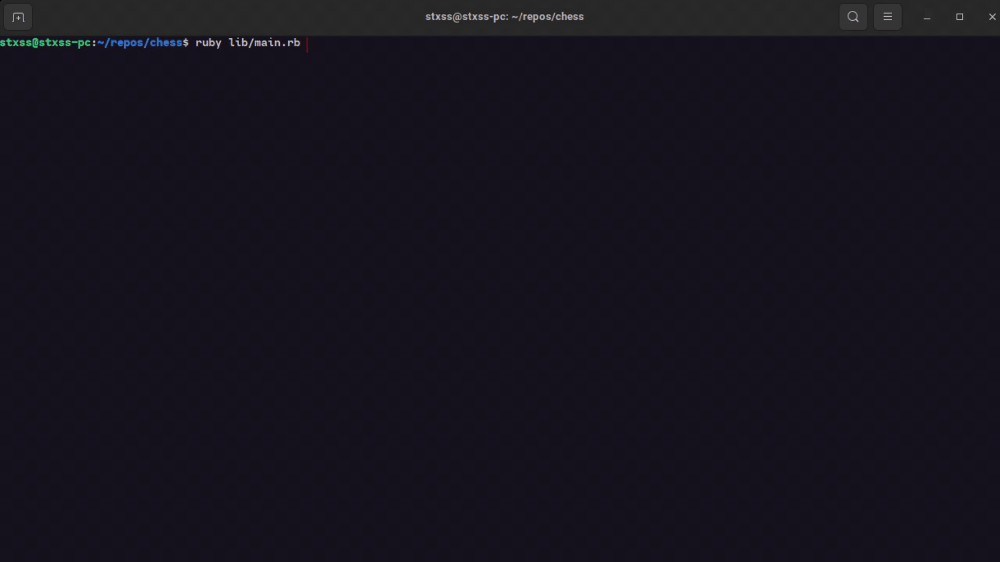
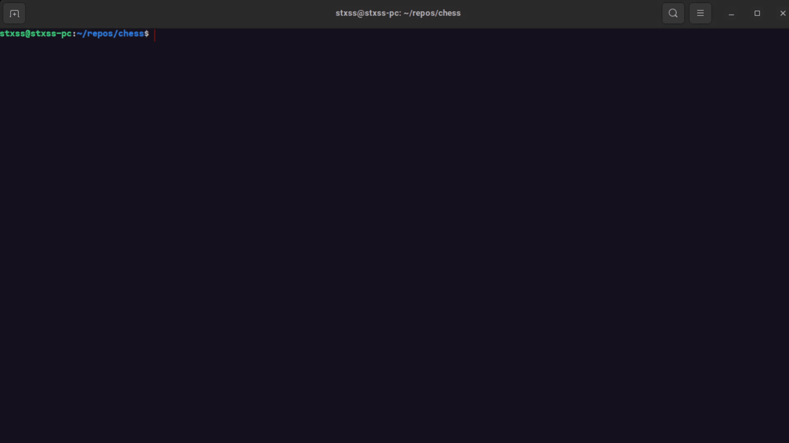

# TOP Chess - @stxss
This is the Final Project in the Ruby Chapter from [The Odin Project](https://www.theodinproject.com/lessons/ruby-mastermind)

I chose not to encourage you to go on repl.it as it is very tedious, slow and ugly on there, as it has a lot of problems supporting colors. So just cloning this onto your machine is way better and faster. But if you still want to check it out there, you can click [here](https://replit.com/@stxss/Chess).

## Simple Demo
 

This was the toughest project so far, as the objective was to create a chess game from scratch.

At first I thought that I could make a simple chess game by prompting the user to write the square names and play like that, but I wanted the game to be more interactive than that.

As the goal was to make this game in the CLI, mouse movements wouldn't be accepted. So, I dediced to rely on the keystrokes, assigning 3 possible ways to move around the board, a selection and de-selection pieces, promoting numbers, castling keys and options to quit and/or save.

## Project requirements
**Two Players** - pretty basic to setup

**Constrained movement** - Declaring Check, Checkmate in correct situations and preventing the players from making illegal moves. Setting the possible movements for the pieces and seeing if it is in check is pretty easy. As for checking for a checkmate, seeing what possible options you can have when checked, what moves you cannot make because you'll have the king in check was probably the toughest part of this project.

**Serialization** - Saving current board state to possibly play later. Also pretty basic. Here are all the pre-saved options I made. You can quickly access en-passant, promotion, a saved game against AI, the fool's mate and the quickest stalemate possible! As for castling I challenge you to try it yourself in-game.

**Testing** - No strict TDD though. I used this mainly for refactoring code. IMO I tested all the necessary behaviour, but being a newbie regarding testing, I could come back to this in the future and make a better test suite.

**Optional AI** - Create a simple AI to play against. This was a tricky one. Even though my intention was simple, to have it only play as black by picking a single piece, it would frequently crash and clash with the "safe" pieces/options to pick from, leaving the loop for choosing go on infinitely. But thanks to that, I was able to refactor and optimize the code regarding the path checks.

## Human vs AI
 
Here's a simple quick demo of a game of a human against the computer

## How to Play
You can clone this repo on your local machine. (Just beware that you'll probably want to zoom your terminal in, as the unicode chess pieces are pretty small and there's really no way of making them bigger)

## Pre-requisites
ruby >= 3.1.2

bundler >= 2.3.7

## Installation
 - Clone this repository on your machine. If you don't know how to, check out the [instructions](https://docs.github.com/en/repositories/creating-and-managing-repositories/cloning-a-repository).
 - Navigate into the project's root directory `cd chess`
 - Run `bundle install`

## Play!
 - Run `ruby lib/main.rb` and enjoy!

